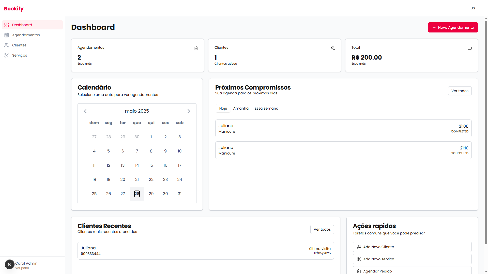
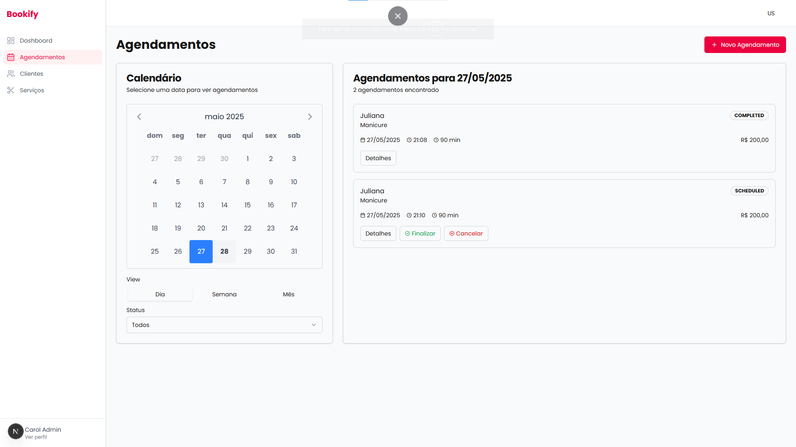
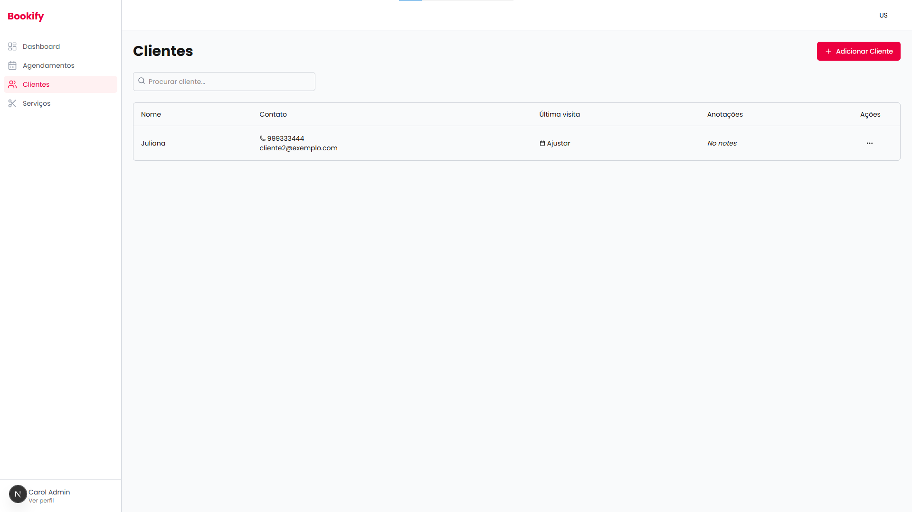
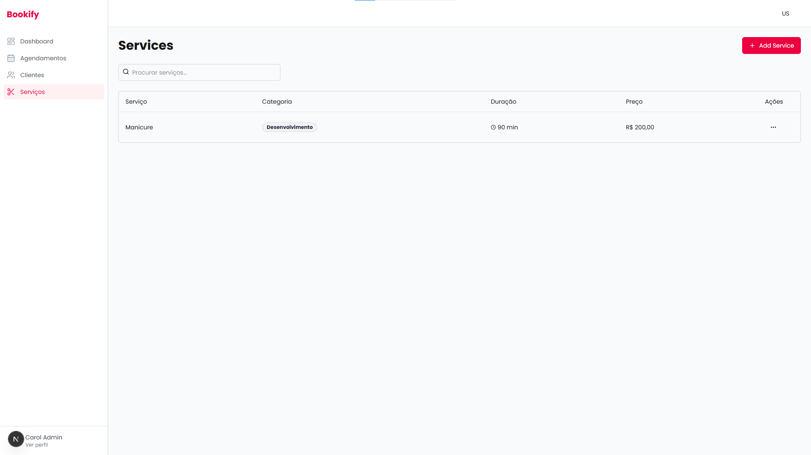

# 📆 Bookify - Sistema de gerenciamento de pedidos

  <h1>Bookify</h1>  
  

    <strong>A solução completa para profissionais</strong>
  

  
  

    Simplifique seu negócio com nossa plataforma de gerenciamento, especificamente projetada para proprietários e profissionais  que oferecem serviços e produtos.
  

  

    <a href="#features">Features</a> •
    <a href="#demo">Demo</a> •
    <a href="#installation">Installation</a> •
    <a href="#usage">Usage</a> •
    <a href="#contributing">Contributing</a>
  

  

    
    
    
    
  

---

## 📸 Telas
### Landing Page Overview

### Dashboard Overview

### Appointment Management

### Client Management

### Service Catalog

---

## ✨ Recursos

### 🏢 **Suporte Multiempresa**
- **Isolamento Completo de Dados**: Cada empresa opera de forma independente
- **Acesso por Funções**: Papéis de Proprietário, Administrador e Funcionário com permissões distintas
- **Financeiro**: Acompanhamento de receitas.
- **Configurações da Empresa**: Dias úteis de atendimento configuráveis

### 👥 **Gestão de Clientes**
- **Perfis Completos:**: Armazene informações de contato e preferências dos clientes
- **Histórico de Visitas:**: Acompanhe todos os agendamentos e serviços anteriores
- **Notas e Preferências**: Registre alergias, preferências e observações especiais
- **Ações Rápidas:**: Agende novos atendimentos diretamente pelo perfil do cliente

### 📅 **Agendamento de Atendimentos**
- **Calendário Interativo**: Visualizações por dia, semana e mês
- **Disponibilidade em Tempo Real**: Evita automaticamente agendamentos duplicados
- **Gestão de Status**: Acompanhe atendimentos agendados, concluídos, cancelados e ausentes
- **Agendamento Flexível**: Reagendamento e cancelamento com facilidade

### 💼 ** Catálogo de Serviços**
- **Serviços Ilimitados**: Crie e gerencie todas as suas ofertas de serviços
- **Preços e Duração:**: Defina valores personalizados e tempos de execução
- **Categorias**: Organize os serviços por tipo (Manicure, Pedicure, Acrílico, etc.)
- **Descrição dos Serviços**: Informações detalhadas sobre cada serviço

### ⏰ **Gestão de Horários de Trabalho**
- **Horários Flexíveis:**: Configure horários distintos para cada dia da semana
- **Agenda da Equipe**: Horários de trabalho individuais para cada membro da equipe
- **Gestão de Feriados**: Desative dias específicos com facilidade
- **Gestão de Horários**: Impede agendamentos fora do horário de funcionamento

### 🔒 Segurança e Privacidade
- **Autenticação Segura**: Contas protegidas com senhas criptografadas
- **Privacidade de Dados**: Isolamento completo de dados entre empresas
- **Permissões por Função**: Controle de acesso baseado nas funções dos usuários
- **Armazenamento Seguro de Dados**: Todos os dados criptografados e armazenados com segurança
---

## 🚀 Demo

### Live Demo
🌐 **[Try NailPro Live Demo](https://nailpro-demo.vercel.app)**

### Demo Credentials
\`\`\`
Company: Bella Nails Studio
Email: maria@bellanails.com
Password: password123
\`\`\`

### Demo Features
- ✅ Full appointment management
- ✅ Client and service management
- ✅ Payment tracking
- ✅ Company settings
- ✅ Multi-user support

---

## 🛠️ Tech Stack

### Frontend
- **[Next.js 14](https://nextjs.org/)** - React framework with App Router
- **[TypeScript](https://www.typescriptlang.org/)** - Type-safe JavaScript
- **[Tailwind CSS](https://tailwindcss.com/)** - Utility-first CSS framework
- **[shadcn/ui](https://ui.shadcn.com/)** - Beautiful UI components
- **[React Hook Form](https://react-hook-form.com/)** - Form management
- **[Zod](https://zod.dev/)** - Schema validation

### Backend
- **[Prisma](https://www.prisma.io/)** - Database ORM
- **[PostgreSQL](https://www.postgresql.org/)** - Primary database
- **[bcryptjs](https://github.com/dcodeIO/bcrypt.js)** - Password hashing
- **[date-fns](https://date-fns.org/)** - Date manipulation

### Development
- **[ESLint](https://eslint.org/)** - Code linting
- **[Prettier](https://prettier.io/)** - Code formatting
- **[TypeScript](https://www.typescriptlang.org/)** - Type checking
- **[Docker](https://www.docker.com/)** -  Isolated development environment
---

## 🎯 Usage

### Getting Started

1. **Create Your Company**
   - Sign up and create your nail salon profile
   - Upload your logo and set company information
   - Configure your working hours and preferences

2. **Add Your Services**
   - Create your service catalog with prices and durations
   - Organize services by categories
   - Set up service descriptions and details

3. **Manage Clients**
   - Add client information and contact details
   - Record preferences, allergies, and notes
   - Track client visit history

4. **Schedule Appointments**
   - Use the calendar to book appointments
   - Assign services and set prices
   - Track appointment status and payments

## 📄 License

This project is licensed under the MIT License - see the [LICENSE](LICENSE) file for details.

---

## 🙏 Acknowledgments

- **[shadcn/ui](https://ui.shadcn.com/)** for the beautiful UI components
- **[Lucide](https://lucide.dev/)** for the icon library
- **[Vercel](https://vercel.com/)** for hosting and deployment
- **[Prisma](https://www.prisma.io/)** for the excellent database toolkit

---
Now let's create the documentation structure with placeholder images:

